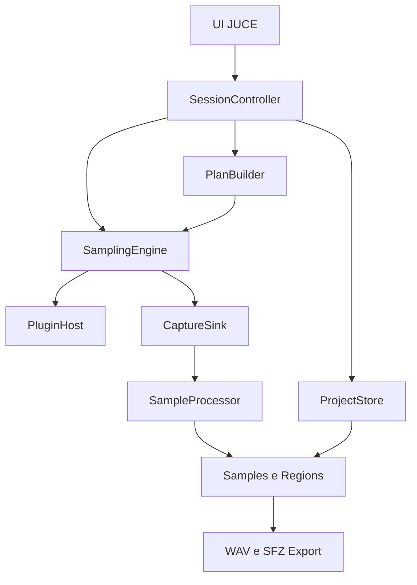

# K2M — Arquitetura e plano de implementação

## 1. Parecer de viabilidade

**Recomendação: prosseguir com uma prova de conceito pequena em C++20, JUCE 8 e CMake, hospedando uma única instância de Kontakt VST3.** O produto deve ser um autosampler local. Seu núcleo é gerar eventos MIDI, processar o plugin e registrar o áudio retornado. Ler contêineres NKX/NKC não faz parte da solução.

O suporte de hosting do JUCE e o exemplo AudioPluginHost dão uma base concreta para essa estratégia. A Native Instruments documenta o uso do Kontakt como plugin e opções de processamento offline. Isso sustenta a viabilidade técnica, mas não constitui validação do K2M no Windows nem de uma biblioteca específica.[^1][^2][^3]

| Resultado pretendido | Avaliação | Condição para avançar |
| --- | --- | --- |
| Kontakt → MIDI → buffers → WAV | Alta plausibilidade técnica | POC executada no Windows com Kontakt instalado |
| Interface original do Kontakt | Suportada pelo modelo de hosting | Validar criação, fechamento, redimensionamento e DPI |
| Captura por nota e velocity | Viável após a POC | Scheduler em frames e isolamento entre capturas |
| WAV + mapeamento SFZ | Viável | Testar semântica de envelopes e dinâmica em player SFZ |
| Reprodução no MODX M | Viável por importação/conversão | Teste real de uma pequena Waveform no teclado |
| Offline mais rápido que tempo real | Plausível, não garantido | Comparação por preset, versão e configuração |
| Cópia integral do comportamento de um NKI | Fora da capacidade de multisamples simples | Scripts, legato e modulações exigem aproximações |
| Writer Y2L/Y2U próprio | Possível objeto de pesquisa | Não necessário para validar ou entregar o primeiro fluxo útil |

Este documento define decisões, contratos, experimentos e critérios de aceite. **Nenhum executável K2M foi construído ou testado nesta avaliação.** Não houve acesso ao Kontakt instalado nem ao MODX M físico. A documentação foi consultada em 14 de setembro de 2026; versões instaladas devem ser registradas nos experimentos.

### 1.1 A ressalva de licença que realmente importa

Uso pessoal elimina necessidades de distribuição do aplicativo, mas não torna qualquer biblioteca livre para resampling. A seção 3.7 do EULA público da NI restringe o emprego de seu conteúdo na criação de bibliotecas para outros instrumentos; o trecho não estabelece uma exceção explícita para uso pessoal. Bibliotecas de terceiros precisam ser avaliadas conforme seus próprios termos. Portanto, a POC deve usar gravações próprias carregadas em um instrumento editável do Kontakt, ou conteúdo cuja licença permita a operação. Possuir e conseguir tocar uma biblioteca não prova essa autorização.[^4]

Essa constatação não exige um sistema de DRM, autenticação ou aprovação dentro do K2M. Basta manter a origem e uma nota de permissão nos metadados do projeto. A análise aqui é uma leitura técnica das condições publicadas, não uma conclusão jurídica sobre todas as bibliotecas ou exceções legais aplicáveis.

### 1.2 Dois gates independentes

**Gate A — captura:** salvar corretamente `C3_v100.wav`, com ataque, nota sustentada e release. O restante do engine não começa antes de resolver esse núcleo.

**Gate B — destino:** importar um pequeno instrumento de teste no MODX M, verificar notas, velocities, loops quando aplicáveis e memória ocupada. Esse experimento deve ocorrer cedo, antes da UI de mapeamento e dos algoritmos avançados.

Uma POC com WAV correto aprova o Gate A, mas não aprova automaticamente o Gate B nem o uso de todas as bibliotecas.

## 2. ADR-001 — C++20, JUCE 8 e CMake

**Status:** recomendado; confirmação prática pelo Gate A.

**Contexto:** Windows 11 x64, plugin VST3 com interface nativa, processamento de áudio em buffers e interface simples. Um processo local, um instrumento por vez e ausência de serviços remotos reduzem muito o escopo.

**Decisão:** aplicativo GUI JUCE, C++20, CMake e MSVC x64. Usar uma versão 8.x fixada por tag e commit. A tag 8.0.12 foi consultada como referência de código e licenças; não é apresentada como a versão mais recente. Não depender de `master`, e não migrar silenciosamente de major por causa da documentação online.[^1][^5]

C++20 basta para RAII, estruturas tipadas, `std::span`, enums e recursos modernos de biblioteca. C++23 não oferece um benefício necessário ao gate. Projucer é opcional; CMake mantém a construção reproduzível e adequada ao trabalho com agentes.

Usar o suporte VST3 incluído no JUCE escolhido. Não integrar uma segunda cópia do SDK manualmente, salvo necessidade demonstrada. Não desenvolver wrappers VST3 próprios no MVP.

| Alternativa | Ganho possível | Custo relevante | Decisão |
| --- | --- | --- | --- |
| JUCE inteiro | Hosting, dispositivos, MIDI, WAV e GUI integrados | Acoplamento ao framework | Escolha principal |
| SDK VST3 direto + Win32 | Controle de baixo nível | Muito mais trabalho de hosting e ciclo de vida da GUI | Apenas se houver bloqueio comprovado do wrapper |
| DAW existente + automação | Referência rápida para comparar áudio | Dependência e automação de aplicação externa | Ableton como instrumento de diagnóstico |
| Engine de DAW completo | Roteamento, timeline e plugins adicionais | Abstrações não necessárias para um instrumento | Não adotar |
| Ferramenta pronta de autosampling | Evitar construir o aplicativo | Menos controle sobre workflow e formatos | Alternativa de produto se a POC custar demais |

Não são necessários banco de dados, API, aplicação web, containers ou infraestrutura cloud. JSON do próprio JUCE, WAV do JUCE e funções C++ bastam inicialmente. O mesmo executável pode ganhar um modo de scan auxiliar mais tarde, sem introduzir arquitetura distribuída.

## 3. Escopo do primeiro MVP

O MVP deve carregar um Kontakt, permitir selecionar manualmente um preset, capturar notas com uma lista de velocities, salvar e retomar projetos, preservar áudio bruto, aplicar trim conservador, gerar regiões e exportar WAV + SFZ. Deve incluir preview do WAV, indicadores de clipping/silêncio e estimativa básica de disco/tempo.

No MVP, uma sessão usa um canal MIDI, um par de saída, uma articulação e um estado estático de controles. Não há detecção de articulações, descoberta automática de camadas internas ou leitura de parâmetros privados do Kontakt.

Ficam para depois: loops automáticos, round robins, sequências de keyswitches, CC morphing, captura de sustain em estados separados, aftertouch, pitch bend amostrado, comparação espectral, deduplicação aproximada, redução automática de samples e exportação Yamaha nativa.

Salvar o release faz parte do MVP. Recriar fielmente o release para qualquer duração de nota no teclado é um problema diferente, descrito na seção 10.

## 4. POC prioritária: especificação executável

### 4.1 Preparação do ambiente

1. Windows 11 x64, compilador MSVC com ferramentas de desktop C++, Windows SDK e CMake.
2. Checkout fixado de JUCE 8; registrar commit, versão do compilador e configuração Release/Debug.
3. Kontakt VST3 instalado e autorizado pelo procedimento normal da NI. Native Access pode ser necessário para instalação/ativação, mas não será uma dependência criada pelo K2M para cada captura.[^2]
4. Instrumento conhecido: preferencialmente um NKI próprio com áudio próprio, em Kontakt completo quando a edição for necessária. Depois testar um preset real permitido.
5. Saída do instrumento em `st.1`, canal MIDI 1 ou Omni, sem outro instrumento no rack. Configurar ganho com folga.
6. Compilar primeiro o AudioPluginHost da mesma tag do JUCE e verificar se ele abre o Kontakt. Isso fornece uma referência independente do código K2M.[^1]

Comandos conceituais para a futura implementação:

```powershell
cmake -S . -B build -A x64
cmake --build build --config Release --target K2M
ctest --test-dir build -C Release --output-on-failure
```

O projeto deve usar `juce_add_gui_app`, não `juce_add_plugin`. Ativar `JUCE_PLUGINHOST_VST3=1`; desativar formatos não usados. Ligar os módulos de GUI, devices, processors, formats e, quando necessário, DSP. Usar headers dos módulos diretamente evita exigir um `JuceHeader.h` gerado. Desabilitar web browser e CURL no aplicativo se não forem necessários. Começar com WASAPI; ASIO não é requisito para capturar a saída interna do plugin.

### 4.2 Descoberta do Kontakt

A busca inicial deve procurar módulos `.vst3` no diretório padrão `C:\Program Files\Common Files\VST3`, permitir selecionar um módulo manualmente e aceitar subdiretórios. Não fixar o nome literal `Kontakt.vst3`: a instalação pode apresentar nome com versão. Um módulo VST3 pode ser um bundle; não selecionar diretamente uma DLL interna.[^6]

Usar `AudioPluginFormatManager`, o formato VST3 e `PluginDescription`. Identificar os candidatos pelo fabricante, nome e identificador fornecidos pelo scan, e deixar a seleção explícita quando houver várias versões. Persistir descrição, caminho, versão e identificador; caminho sozinho não é identidade suficiente.

Na POC, fazer scan direcionado do candidato. `KnownPluginList` e `PluginDirectoryScanner` servem para cache e varredura posterior. O mecanismo de dead-man's-pedal do scanner ajuda a reconhecer falhas anteriores, mas não isola crashes: scan dentro do processo ainda pode derrubar o aplicativo.[^7]

### 4.3 Instância e interface

Instanciar com `AudioPluginFormatManager::createPluginInstanceAsync`. Manter o message loop ativo. No callback, validar erro, guardar a instância com ownership claro e inspecionar buses. Criar a interface com `createEditorIfNeeded()` ou a API equivalente da tag, hospedando-a em `DocumentWindow`. Criar e destruir editor na message thread; destruir editor antes do plugin.[^8][^9]

A UI principal precisa apenas de seleção do plugin, abrir editor, dispositivo de áudio, armar captura, iniciar, cancelar, indicador de nível e caminho do WAV. Enquanto captura, impedir mudanças de preset e fechamento da instância. O editor pode permanecer visível para diagnóstico, mas não deve ser alterado durante um job.

Usar `Component::SafePointer` ou token de vida no callback assíncrono para não acessar uma janela destruída. Não transferir a instância para o callback de áudio enquanto buses e preparação ainda estão sendo alterados.

### 4.4 Áudio e timeline da POC

**Modo inicial:** tempo real, conduzido pelo callback do dispositivo. Solicitar 44.100 Hz e blocos de 512 frames, mas registrar os valores efetivos. Se o dispositivo negociar outra taxa, exibir isso e usar essa taxa de forma consistente. A conversão de taxa não entra escondida na POC.

Consultar o layout aceito pelo plugin. Preferir saída principal estéreo, sem entrada de áudio e com saídas extras desativadas. Se o Kontakt não aceitar isso, manter seu layout válido, alocar os canais necessários e capturar explicitamente o bus desejado. Nunca assumir que os únicos canais retornados são o par que interessa.

Para a primeira nota, alocar **antes** do callback um buffer de captura de duração máxima. Um take de 7,25 s, 44,1 kHz, estéreo float32 ocupa aproximadamente 2,56 MB. Isso é mais simples do que introduzir FIFO e writer assíncrono na primeira demonstração. Ao terminar, passar o buffer imutável para um worker gravar. Não manter todas as notas de um projeto em RAM.

Convenção explícita: **C3 do K2M = MIDI 60, convenção Yamaha/Ableton**. Também exibir `MIDI 60`; a nomenclatura de oitavas é configurável. Em notação científica, MIDI 60 costuma ser chamado C4. Nunca converter nomes sem guardar a convenção. O arquivo solicitado permanece `C3_v100.wav`.

| Posição relativa | Evento |
| --- | --- |
| Antes de armar | Aguardar carga completa; testar nota manualmente; limpar vozes anteriores |
| 0,00 s | Início do take e pré-roll de 0,25 s |
| 0,25 s | Note On MIDI 60, canal 1, velocity 100 |
| 5,25 s | Note Off MIDI 60 |
| 7,25 s | Fim da janela de release de 2 s; registrar se ainda há sinal |
| Depois do take | Finalizar WAV em worker; reabrir e medir |

Os tempos são convertidos uma vez para índices `int64` em frames. Não usar `Timer`, `sleep()` ou relógio da UI para decidir quando emitir Note Off. `AudioPlayHead` fornece tempo, andamento e posição ao plugin quando necessário; o relógio musical avança pelos frames processados, inclusive em offline.[^10]

### 4.5 Pseudocódigo do caminho crítico

As operações `capture.copy`, `publishDone` e `addEventsInRange` abaixo pertencem ao K2M; são contratos, não APIs prontas do JUCE. Tudo que cresce em memória é preparado antes de armar.

```cpp
// message/control thread; callback de áudio ainda não possui o plugin
loadPluginAsync(description, sampleRate, maxBlock, callback);

// callback de criação, com retorno seguro à message thread
configureSupportedBuses(*plugin);
plugin->setPlayHead(&playHead);
plugin->setNonRealtime(false);
plugin->prepareToPlay(sampleRate, maxBlock);
openOriginalEditor(*plugin);

// ao armar, fora da audio thread
capture.allocate(channelsToCapture, captureFrames);
audioScratch.allocate(allRequiredPluginChannels, maxBlock);
midi.ensureSize(reservedMidiBytes);
events = makePocTimeline(sampleRate, /* note */ 60, /* velocity */ 100);
publishPreparedSessionToAudioThread();

// audio callback: proprietário exclusivo de processBlock
void process(float** deviceOutput, int frameCount) {
    juce::ScopedNoDenormals noDenormals;
    clearDeviceOutputs(deviceOutput, frameCount);
    forEachPreallocatedChunk(frameCount, maxBlock, [&](int count) {
        auto audio = scratchView(count); // sem alocação
        audio.clear();
        midi.clear();
        // Eventos no intervalo semiaberto [cursor, cursor + count)
        addEventsInRange(events, cursor, count, midi);
        playHead.updateFromFrameCursor(cursor, sampleRate, bpm);
        plugin->processBlock(audio, midi);
        // MIDI de saída do plugin não é reinjetado no próximo bloco.
        if (captureIsArmed)
            capture.copySelectedBusWithinTakeBounds(audio, cursor, count);
        copySelectedBusToMonitor(audio, deviceOutput, monitorGain);
        cursor += count;
        if (takeFinished())
            publishDoneWithoutAllocatingOrWritingToDisk();
    });
}

// worker, somente após reconhecer que o callback não escreve mais no take
writeWavToTemporaryPath(capture, sampleRate, /* PCM bits */ 24);
closeWriterAndValidateFrameCount();
renameTemporaryWavToFinalPath();
```

O cursor da sessão e o cursor do take devem ter uma origem bem definida; ao iniciar uma nova captura, agendar os eventos relativos ao frame de início publicado. Um evento exatamente no limite final de um bloco pertence ao bloco seguinte, com offset zero. Se o último bloco ultrapassar o fim do take, copiar apenas os frames válidos.

MIDI é inserido com offsets em frames via `MidiBuffer::addEvent`. Reservar capacidade do buffer reduz alocações do próprio scheduler; a segurança interna do plugin é responsabilidade de sua implementação, e deve ser medida, não presumida.[^11]

### 4.6 Eventos MIDI

| Intenção | Construção JUCE | Valores e interpretação |
| --- | --- | --- |
| Note On | `MidiMessage::noteOn(ch, note, uint8Velocity)` | Canal 1–16; nota 0–127; velocity 1–127 |
| Note Off | `MidiMessage::noteOff(ch, note)` | Registrar release velocity se futuramente usada |
| Control Change | `controllerEvent(ch, cc, value)` | CC e valor 0–127 |
| Sustain | `controllerEvent(ch, 64, value)` | MVP usa estado desligado; estados de pedal vêm depois |
| Mod wheel | `controllerEvent(ch, 1, value)` | Zero pode silenciar determinados presets |
| Pitch bend | `pitchWheel(ch, value)` | 0–16383; centro 8192; faixa em semitons depende do instrumento |
| Channel pressure | `channelPressureChange(ch, value)` | Pressão comum ao canal |
| Poly aftertouch | `aftertouchChange(ch, note, value)` | Pressão por nota; testar suporte fim a fim |
| Keyswitch | Note On/Off normal | Seu significado vem do preset, não do padrão VST3 |

Essas construções existem no JUCE.[^12] Isso não garante que cada controle esteja mapeado no Kontakt. O wrapper precisa traduzir os controles para a representação VST3 apropriada; testar CC1, CC64, bend e pressure separadamente antes de anunciar suporte. Para mudanças simultâneas, usar eventos de setup antes da nota, com tempo de estabilização, sem depender de ordem ambígua dentro do mesmo frame.

### 4.7 Critérios de aprovação do Gate A

Salvar WAV legível, com taxa/canais/quantidade de frames corretos, áudio não silencioso e ausência de NaN/Inf. Um instrumento de teste previsível deve demonstrar início e fim nos frames esperados, descontada a latência medida. O arquivo deve ser reaberto por leitor independente e ouvido no Ableton.

Executar dez takes consecutivos, reabrir o aplicativo e repetir. Sem crash, nota presa, truncamento inesperado ou alteração de ganho. Não exigir WAV bit a bit idêntico de presets aleatórios. O núcleo é aprovado primeiro em instrumento controlado e depois em três presets permitidos: percussivo, sustentado e com release audível.

Uma janela de 2 s é parâmetro de teste, não garantia de capturar toda cauda. Se o áudio continuar no fim, marcar `tailTruncated`; aumentar a janela e repetir antes de aceitar o sample como completo.

### 4.8 Diagnóstico de bloqueadores

| Sintoma | Hipóteses a verificar | Experimento isolador |
| --- | --- | --- |
| Plugin não aparece | Nome diferente, versão não instalada, módulo inválido | Seleção manual + AudioPluginHost |
| Instancia, mas GUI não abre | Message loop, ownership, DPI, versão do wrapper | Janela flutuante mínima; sem engine próprio |
| MIDI chega, sem áudio | Canal, bus, instrumento vazio, range, CC1/CC11 | Teclado da GUI + inspeção de todos os buses |
| Primeira nota falha | Background loading ou purge | Aguardar carga e repetir após aquecimento |
| Áudio corta cedo | Proteção de CPU, vozes, script, janela curta | Instrumento próprio sem efeitos; bloco maior |
| Som muda em offline | Interpolação, tempo do host, randomização | Fixar HQI e comparar envelope/espectro |
| Crash ao fechar | Editor destruído tarde ou callback ativo | Parar callbacks, aguardar, destruir editor e instância |
| Travamento em processBlock | Plugin ou streaming bloqueado | Debugger; não tentar matar thread à força |

## 5. Offline rendering: hipótese controlada

A NI oferece configuração de interpolação para bounce offline, e alerta que carga em segundo plano pode deixar algumas teclas inicialmente sem som. Sua documentação também descreve proteção que encerra vozes quando a CPU sobrecarrega e possíveis diferenças de estabilidade no multiprocessamento.[^3] São razões concretas para testar offline com arquivos já carregados.

**Não há nesta avaliação evidência suficiente para prometer um fator de aceleração do Kontakt em um host JUCE próprio.** A interface `setNonRealtime(true)` informa a intenção de bounce; não garante que todos os presets terminem corretamente nem que um plugin com streaming acompanhe um loop ilimitado.[^9]

Depois do modo de referência funcionar:

1. Parar e remover a instância do callback de dispositivo, com reconhecimento de que nenhum processamento está em andamento.
2. Em ponto seguro, liberar/preparar recursos conforme o ciclo de vida da tag; configurar `setNonRealtime(true)` e o playhead antes da renderização.
3. Um worker exclusivo chama `processBlock` sequencialmente, avançando o cursor sem esperar tempo de parede.
4. A UI continua atendendo eventos; nenhuma mudança de preset/state enquanto renderiza.
5. O worker pode escrever em disco diretamente, pois não está sob deadline do dispositivo. Cancelamento acontece entre blocos; não interromper arbitrariamente uma chamada do plugin.
6. Retornar ao modo realtime somente após o worker entregar a instância e concluir o processamento.

Comparar blocos 128, 512 e 1024; três notas graves/médias/agudas; velocity baixa e alta; efeito desligado e ligado. Fazer referência realtime, depois offline com HQI equivalente e, separadamente, HQI de maior qualidade. Medir duração de parede, clipping, frames, posição do ataque, RMS da cauda e anomalias auditivas.

O modo offline será habilitado por preset/configuração validada. Se falhar, usar realtime. A falha da aceleração não invalida o produto. Não aumentar paralelismo com múltiplos Kontakt antes de medir RAM, streaming e estabilidade de uma única instância.

## 6. Arquitetura de módulos



As setas representam dependências de chamadas/dados; não threads, processos ou rede. `SessionController` coordena transições. `PlanBuilder` é puro. `PluginHost` conhece JUCE/VST3, mas não SFZ ou Yamaha. `SampleProcessor` recebe áudio e configuração, sem chamar o plugin. Exportadores consomem o modelo intermediário, sem conhecer o estado de captura.

| Pasta proposta | Responsabilidade | Arquivos iniciais sugeridos |
| --- | --- | --- |
| `Source/App/` | Entry point e coordenação | `Main.cpp`, `SessionController.h/.cpp` |
| `Source/Plugin/` | Scan, instância, state e editor | `PluginHost.h/.cpp` |
| `Source/Sampling/` | Plano, jobs, scheduler e estados | `SamplingPlan.h`, `SamplingEngine.h/.cpp` |
| `Source/Audio/` | Callback, captura e medição simples | `AudioEngine.h/.cpp`, `CaptureSink.h/.cpp` |
| `Source/DSP/` | Análise e transformações offline | `SampleProcessor.h/.cpp` |
| `Source/Mapping/` | Sample/Region e partição de ranges | `Multisample.h`, `Mapper.h/.cpp` |
| `Source/Export/` | WAV, SFZ e relatório de perdas | `Exporters.h/.cpp` |
| `Source/Project/` | JSON, checkpoints e recuperação | `ProjectStore.h/.cpp` |
| `Source/UI/` | Telas próprias do K2M | `MainComponent.h/.cpp` |
| `Tests/` | Testes determinísticos sem Kontakt | Arquivos por comportamento |

Essa é a organização de chegada do MVP. **Não criar todas as pastas vazias na Phase 0.** A POC pode começar com `Main.cpp`, `MainComponent` e um controlador de hosting/captura. Extrair módulos quando a responsabilidade existir.

Não usar framework de injeção de dependência, event bus global ou hierarquia de estratégias DSP. Funções e estruturas simples bastam. Um adaptador pequeno de processamento facilita usar uma fonte de teste no lugar do Kontakt. Duas implementações de `CaptureSink` podem existir quando necessário: RAM para POC e streaming para lotes.

## 7. Sampling Engine e sequência de jobs

### 7.1 Contrato do plano

```json
{
  "startNote": 21,
  "endNote": 108,
  "noteStep": 3,
  "includeEndNote": true,
  "velocities": [32, 64, 96, 127],
  "noteDurationSeconds": 5,
  "releaseMinSeconds": 2,
  "releaseMaxSeconds": 8,
  "preRollSeconds": 0.25,
  "settleSeconds": 0.25,
  "roundRobins": 1,
  "midiChannel": 1,
  "articulations": ["default"],
  "controllerStates": [{"id": "default", "cc": {"1": 0, "64": 0, "11": 127}, "pitchBend": 8192}],
  "renderMode": "realtime",
  "sampleRate": 44100,
  "rawEncoding": "float32"
}
```

Os CC acima são exemplo, não reset universal. É possível que CC1=0 torne um instrumento orquestral inaudível. O estado real deve ser ouvido e congelado antes de gerar o lote. CC7/CC11 também podem alterar ganho; não redefini-los silenciosamente.

Validar nota 0–127, começo ≤ fim, passo ≥1, velocities únicas 1–127 e durações finitas positivas. Ordenar nota e velocity; não gerar Note On com velocity zero. Usar `includeEndNote=true` para acrescentar o limite superior caso o passo não o alcance. Persistir a lista explícita de jobs gerada.

O exemplo começa em MIDI 21, que é A0 na notação científica e A−1 na convenção C3=MIDI60. Não chamar essa primeira nota de C1. Os nomes são apresentação; o plano usa números.

Ordem estável: articulação → estado de controles → nota ascendente → velocity ascendente → repetição. Um `jobId` deriva de representação canônica versionada do plano, identificação de origem e coordenadas; não usar `std::hash` como hash persistente, pois sua estabilidade não é um contrato de formato.

### 7.2 Máquina de captura

```mermaid
stateDiagram-v2
    [*] --> Ready
    Ready --> Preparing: iniciar job
    Preparing --> PreRoll: recursos prontos
    PreRoll --> NoteHeld: Note On
    NoteHeld --> Releasing: Note Off
    Releasing --> Finalizing: silêncio confirmado ou limite
    Finalizing --> Processing: raw válido
    Processing --> Ready: commit do resultado
    Preparing --> Failed: erro
    NoteHeld --> Failed: falha de captura
    Releasing --> Failed: erro
    Processing --> Failed: erro
    Failed --> Ready: retry explícito
```



A sequência determinística é uma propriedade dos **jobs e eventos**, não uma promessa sobre os bytes produzidos pelo Kontakt. Round robin, randomização e scripts podem depender de histórico não exportado no state. Registrar take/attempt e resultados reais.

Cada job faz setup de controles, aguarda estabilização, captura pré-roll, envia a nota, mantém o processamento após Note Off e só então finaliza. A limpeza de vozes ocorre depois da cauda. `All Sound Off`, `reset()` e recarga de state não podem ser usados no meio do release.

Se o preset nunca fica silencioso, encerrar pelo teto, registrar cauda cortada e exigir revisão. Não iniciar outro job deixando áudio anterior contaminar a captura. Um procedimento de reset entre jobs deve ser testado por preset; ele não garante restaurar o índice interno de round robin.

Pausa normal termina o job e faz checkpoint. Cancelamento imediato descarta o take parcial, encerra notas/pedal e deixa o job reexecutável. Retomada sempre começa no início de um job, nunca no meio de uma nota.

## 8. Modelo de dados e projeto `.k2m`

### 8.1 Entidades

| Entidade | Campos essenciais |
| --- | --- |
| `SourceSnapshot` | PluginDescription, versão, caminho, statePath/stateHash, presetLabel, libraryLabel, notas de permissão, buses e configuração relevante |
| `SamplingPlan` | Notas, velocities, estados, tempos, taxa, modo, ordem e versão do gerador |
| `CaptureJob` | id, ordinal, coordenadas, status, attempt, frames dos eventos, erro e timestamps |
| `SampleAsset` | id, rawPath, processedPath, hash, encoding, taxa, canais, frameCount, noteOnFrame, noteOffFrame, métricas, pipelineHash |
| `Region` | assetId, rootKey, keyLow/keyHigh, velocityLow/High, articulation, controllerStateId, roundRobin, trigger, loop |
| `ExportRecord` | Formato, versão do writer, entradas/hashes, data, arquivos e recursos perdidos |
| `TargetProfile` | Modelo/firmware, formatos testados, limites confirmados ou null, memória disponível informada |

Separar asset de região permite reutilizar um WAV em vários mapeamentos e mudar ranges sem regravar. Loop points são em **frames**, não bytes nem valores intercalados por canal. O modelo interno usa intervalos semiabertos: `[startFrame, endFrameExclusive)`.

### 8.2 Estrutura em disco

| Caminho relativo ao projeto | Conteúdo |
| --- | --- |
| `project.k2m` | Manifesto JSON UTF-8 versionado |
| `project.k2m.bak` | Último manifesto válido |
| `state/kontakt.bin` | State opaco retornado pelo host/plugin |
| `raw/` | Takes originais imutáveis e sidecars de captura |
| `processed/` | Resultados derivados com hash de configuração |
| `export/wav/` | WAV destinados a intercâmbio/hardware |
| `export/sfz/` | Instrumento SFZ e samples em caminhos portáveis |
| `temp/` | Arquivos incompletos e exportação em preparação |
| `logs/` | Logs locais por dia |

`.k2m` é JSON, não ZIP e não banco de dados. Usar caminhos relativos para assets. O plugin e suas bibliotecas continuam instalados externamente; o projeto não é um pacote autossuficiente do Kontakt.

Exemplo mínimo ilustrativo; hashes e versão do plugin são preenchidos na execução:

```json
{
  "schemaVersion": 1,
  "projectId": "example-poc",
  "name": "Worship Piano",
  "noteNaming": {"middleC": "C3", "middleCMidi": 60},
  "source": {
    "pluginFormat": "VST3",
    "pluginName": "Kontakt",
    "pluginVersion": null,
    "statePath": "state/kontakt.bin",
    "stateHash": null,
    "presetLabel": "Own test instrument",
    "permissionNote": "Own recording",
    "outputBus": 0
  },
  "planRevision": 1,
  "jobs": [{
    "id": "example-n060-v100",
    "ordinal": 0,
    "note": 60,
    "velocity": 100,
    "articulation": "default",
    "controllerStateId": "default",
    "roundRobin": 0,
    "status": "pending",
    "attempt": 0,
    "rawPath": "raw/n060_v100.wav",
    "error": null
  }],
  "assets": [],
  "regions": [],
  "exports": [],
  "target": {"model": "MODX M", "firmware": null, "verifiedCapabilities": {}}
}
```

### 8.3 Persistência e recuperação

Um worker único é proprietário das alterações do manifesto. Escrever nova versão temporária na mesma unidade, fazer flush, validar JSON e substituir o manifesto preservando backup. No Windows, usar semântica de substituição apropriada e testar falhas reais; um simples rename não deve ser anunciado como garantia absoluta contra perda de energia.

Transação de um take: `recording` persistido → áudio temporário → writer fechado → WAV validado → rename final → sidecar completo → manifesto aponta para raw válido. Depois, `processing` → derivado temporário → validação → commit de `complete`.

| Estado encontrado ao abrir | Ação |
| --- | --- |
| `pending` | Pode executar |
| `recording`, sem raw válido | Volta a pending; preserva diagnóstico do take interrompido |
| `recording`, com raw final e sidecar válido | Reconcilia para processing |
| `processing`, raw válido | Reprocessa; não recaptura |
| `complete`, hashes/arquivos válidos | Mantém completo |
| `complete`, derivado ausente | Reprocessa a partir do raw |
| Raw ausente/corrompido | Marca falha; recaptura somente após revisão |
| `failed` | Exibe motivo e permite retry |

`getStateInformation`/`setStateInformation` permitem guardar/restaurar estado opaco.[^1][^9] Chamá-los em ponto seguro, sem concorrência com processamento. Uma mudança de plugin, preset, buses ou configurações altera a revisão de origem; não misturar novos takes com anteriores silenciosamente.

A restauração pode solicitar arquivos ausentes ou não restaurar uma sequência aleatória idêntica. Antes de continuar, abrir o Kontakt, confirmar carga e tocar notas de verificação. Preservar o conteúdo já capturado evita perder trabalho mesmo quando o state não é perfeitamente reprodutível.

## 9. Threads, ownership e realtime safety

| Contexto | Pode fazer | Não pode fazer |
| --- | --- | --- |
| Message thread | UI, editor do Kontakt, comandos, configuração em ponto seguro | Processar lote ou esperar worker segurando recursos da GUI |
| Audio callback realtime | MIDI pré-agendado, processBlock, copiar PCM, métricas limitadas | Disco, JSON, FFT grande, mutex de projeto, alocar por bloco |
| Writer/control worker | Abrir/fechar arquivos, manifesto, logs, análise e DSP | Chamar processBlock enquanto callback possui a instância |
| Offline worker | Processamento sequencial do plugin e escrita não realtime | Dividir a mesma instância com preview/realtime |

No MVP, captura e processamento de cada job podem ser sequenciais. Não é necessário processar o take anterior enquanto captura o seguinte. Isso diminui competição de disco com o streaming do Kontakt e simplifica recuperação.

Para capturas longas, substituir RAM por uma FIFO SPSC pré-alocada: um produtor de áudio, um consumidor de disco. `AbstractFifo` pode cuidar dos índices; o armazenamento PCM precisa existir separadamente. `AudioFormatWriter::ThreadedWriter` já fornece FIFO e gravação em background, mas o retorno de `write()` precisa ser verificado.[^13]

Se a FIFO encher, **invalidar o take** e informar falha. Não descartar um bloco silenciosamente, não inserir zeros e não esperar o disco na audio thread. Uma fila de 4 s estéreo float a 44,1 kHz ocupa cerca de 1,41 MB; é um ponto inicial a medir, não proteção infinita.

Comandos de UI passam por fila limitada; progresso é publicado por snapshots/atomics. A UI consulta dados a 20–30 Hz. Logs realtime são eventos numéricos compactos em fila limitada; formatação e escrita ficam no worker. Se a fila de logs encher, contar perdas sem interromper áudio; perda de PCM, ao contrário, invalida o take.

Pré-alocar eventos, scratch buffers e indicadores. Não usar `shared_ptr` cujo último destrutor possa executar no callback, nem apagar writers/editors ali. Trocas de sessão precisam de reconhecimento de ownership: publicar parada, aguardar fora do callback, depois liberar recursos.

O plugin pode executar código bloqueante ou falhar dentro do processo. `try/catch` não é uma barreira confiável contra access violation. MVP aceita esse risco com checkpoints. Se houver crashes recorrentes em scan, adicionar processo auxiliar de scan. Se houver crashes/hangs recorrentes de renderização, avaliar worker process isolado como fase posterior, mantendo GUI e IPC como novo custo explícito.

## 10. Release, efeitos e fidelidade musical

**O principal risco musical é confundir a gravação do release com a reprodução correta do release.** Um WAV capturado com Note Off aos 5 s contém esse evento numa posição fixa. Ao tocar o sample durante 1 s ou 10 s, um player simples não move automaticamente esse evento para o instante em que a tecla é solta.

Três estratégias possíveis:

| Estratégia | Uso | Limite |
| --- | --- | --- |
| WAV inteiro, sem loop | POC, percussivos, preview e preservação do original | Release gravado continua preso à timeline do arquivo |
| Sustain em loop + envelope do destino | Pads, órgãos, strings sustentadas | Recria uma aproximação de release; exige loop aceitável |
| Ataque/sustain e release trigger separados | Instrumentos com soltura característica | Exige isolar trigger e controlar envelope/velocity no destino |

No MVP, preservar a cauda no raw e declarar o comportamento da exportação. Não anunciar equivalência ao Kontakt. A etapa avançada deve registrar `noteOffFrame` e permitir renderizações específicas para separar componentes quando o instrumento permitir.

| Recurso de origem | O que a captura preserva | Decisão de engenharia |
| --- | --- | --- |
| Reverb e convolution | Resultado sonoro da nota isolada | Oferecer dry e wet como sessões separadas; dry facilita loops |
| Compressor/saturação global | Resposta à nota isolada | A soma de samples não reproduz necessariamente resposta a acordes |
| Scripts | Resultado daquela execução | Não converter código nem inferir estado privado |
| Round robin | Take efetivamente tocado | Rotular tentativa; não prometer acesso ao índice interno |
| Randomização | Uma realização | Repetições e seleção posterior; state não garante seed |
| Legato | Ataque isolado não contém transição entre notas | Não incluir legato verdadeiro no escopo do mapper simples |
| Keyswitch | Articulação escolhida | Estado explícito com nota de switch, ordem e tempo de setup |
| Velocity switching | Timbre nos valores capturados | Fronteiras internas podem não coincidir com midpoints |
| CC1 morphing | Pontos discretos | Crossfade posterior é aproximação e pode causar faseamento |
| Sustain | Estado de pedal e eventos daquela execução | Capturar pedal down, Note Off e pedal up como eventos distintos |
| Release triggers | Resposta à soltura naquele tempo | Preservar no raw; isolamento e trigger dedicado depois |
| Arpejadores/padrões sincronizados | Frase sob um BPM e transporte | Tratar como frase; não como instrumento sustentado genérico |

Efeitos de saída e roteamento precisam ser conferidos: um send em outro bus pode ficar fora do par capturado. Congelar a configuração de buses faz parte da identidade da origem, não apenas das preferências do computador.[^14]

## 11. DSP Pipeline

**Ordem recomendada:** validação raw → medição/DC opcional → análise de silêncio → trim → análise de sustain/loop opcional → crossfade opcional → fades de borda → ganho global opcional → quantização/dither de exportação → WAV.

Normalização vem depois das operações que podem alterar peak. Cada estágio recebe uma configuração versionada, retorna áudio/metadata e nunca sobrescreve raw. No início, implementar apenas medições, trim conservador e fades curtos quando necessários.

### 11.1 Métricas e silêncio

Por canal, para janela de N frames:

`peak = max(abs(x[n]))`

`rms = sqrt(sum(x[n] * x[n]) / N)`

`dBFS = 20 * log10(max(amplitude, epsilon))`

Usar o maior nível entre os canais para decidir silêncio. Não somar L+R antes da detecção, porque cancelamento de fase poderia transformar áudio estéreo em falso silêncio. Verificar NaN/Inf antes de calcular métricas.

Ponto inicial de engenharia: janelas de 10–20 ms, hops de 5–10 ms, silêncio mantido por 300–500 ms e limiar de análise em torno de −70 dBFS. Medir o pré-roll para estimar noise floor por estatística robusta, acrescentando margem de 6–12 dB. Esses números são defaults experimentais, não especificações do Kontakt.

Separar detecção de início e de fim, com histerese. Um pad pode ter ataque abaixo do limiar durante bastante tempo; nunca aparar automaticamente todo esse início sem inspeção. Silêncio só encerra release depois do mínimo configurado; tremolo ou delay podem ter intervalos silenciosos antes de voltar.

### 11.2 Trim e DC

Encontrar primeiro/último trecho significativo com análise por janelas e refinar a posição em frames. Preservar 5–20 ms antes do ataque detectado e 50–150 ms depois da última energia, conforme instrumento. Para ataques lentos, preferir preservar o Note On e reduzir somente o pré-roll técnico.

Descontar de `noteOnFrame`, `noteOffFrame` e loop points o número de frames removido no início; descartar ou recalcular loops que saíram dos limites. Em estéreo, usar um único recorte temporal para os dois canais.

DC: primeiro medir média por canal. Subtrair média constante apenas quando o desvio justificar; filtro passa-altas muito baixo é alternativa para deriva, mas pode alterar graves e fase. Não remover DC indiscriminadamente de toda gravação, e aplicar fades depois da transformação se criar degrau nas bordas.

### 11.3 Normalização

Desligada por padrão. Se solicitada, calcular um único ganho para o conjunto compatível inteiro, respeitando o maior peak entre notas, velocities e canais. Alvo inicial −1 dBFS de sample peak. Guardar ganho em metadata; nenhuma compressão/limitação automática.

Normalizar cada velocity ao mesmo pico apaga diferenças de intensidade. Normalizar L/R separadamente muda a imagem estéreo. Se no futuro houver ganho por sample, sua compensação precisará fazer parte do mapeamento e do player de destino.

A quantização para PCM16 deve acontecer uma vez, após processamento, com dither apropriado. Float32 raw preserva headroom; não significa que o MODX aceite WAV float. O writer precisa escolher explicitamente encoding e validar o arquivo.[^15]

### 11.4 Loops graduais

Fase inicial de loops: editor manual com audição repetida. Só então automação simples: excluir ataque e release, procurar trecho de energia relativamente estável, gerar candidatos de zero crossing com inclinação semelhante e comparar pequenas janelas ao redor dos pontos.

Uma função de custo inicial pode combinar erro RMS normalizado das janelas, diferença de valor no salto e diferença de derivada. Avaliar ambos os canais usando os mesmos pontos. Zero crossing sozinho não impede click: o espectro, a inclinação e a fase entre canais também importam.

Para sons periódicos, testar comprimentos próximos de múltiplos do período estimado. Para pads/choirs, testar loops mais longos, que mantenham a evolução lenta; se não houver região estável, retornar “sem loop confiável”. Não forçar um resultado em todo sample.

Depois, acrescentar distância entre espectros STFT de magnitude para ranquear candidatos. Ela ajuda a comparar timbre, mas não detecta sozinha a continuidade de fase. Guardar score, métricas e aprovação manual; testar 20–30 repetições audíveis do loop.

### 11.5 Crossfade de loop

Definir exatamente a topologia: num loop `[a,b)`, misturar os últimos F frames com os F frames a partir de `a`; depois o ponto de retorno precisa avançar para `a+F` nessa variante, para não repetir o trecho já misturado. Isso encurta o período efetivo; recalcular e ouvir. Outra topologia pode preservar período usando áudio antes do ponto de início, mas requer material disponível e contrato diferente.

Começar com crossfade linear para trechos correlacionados. Equal-power pode elevar o nível em sinais semelhantes. Limitar F ao tamanho disponível, usar pesos idênticos em L/R e medir peak depois. Fades do começo/fim do arquivo são operações separadas da emenda do loop.

LoopAuditioneer oferece uma referência aberta para busca e audição de loops, mas é uma aplicação antiga e traz suas próprias dependências. Estudar as ideias antes de reutilizar código GPL-3.0.[^16]

## 12. Multisample mapping

Particionar cada combinação de articulação/CC/round robin independentemente. Ordenar roots `r[i]`; fronteira entre vizinhos:

`boundary[i] = floor((r[i] + r[i+1]) / 2)`

Região i começa em `boundary[i-1]+1` e termina em `boundary[i]`; primeira/última usam os limites explícitos do plano. Empate fica com o root inferior. Não extrapolar automaticamente para 0–127 quando o plano só cobre uma parte do teclado.

Exemplo em **notação científica**, diferente do rótulo C3=MIDI60 da POC; os números MIDI eliminam ambiguidade:

| Root | MIDI | Range para domínio MIDI 36–47 |
| --- | --- | --- |
| C2 | 36 | 36–37 |
| D#2 | 39 | 38–40 |
| F#2 | 42 | 41–43 |
| A2 | 45 | 44–47 |

Para velocities `[32,64,96,127]`, o mesmo algoritmo, com domínio de Note On 1–127:

| Velocity capturada | lovel | hivel |
| --- | --- | --- |
| 32 | 1 | 48 |
| 64 | 49 | 80 |
| 96 | 81 | 111 |
| 127 | 112 | 127 |

Essas fronteiras são uma escolha geométrica do K2M, não descoberta da biblioteca. Dar opção de correção manual. Se faltar uma camada devido a falha, não alargar as outras silenciosamente. A exportação completa exige cobertura consistente ou exclusão intencional documentada.

`Region.trigger` deve distinguir ataque e release no futuro. `roundRobin` e `controllerStateId` são dimensões, não atributos decorativos: misturá-las num único range sem condições de seleção faria vários samples soarem ao mesmo tempo.

A afinação também precisa de `fineTuneCents` futuro: enviar MIDI 60 não garante que o preset produza C na afinação padrão. No MVP, registrar transposição e tuning da origem e conferir com nota conhecida.

## 13. Exportação WAV e SFZ

WAV é o áudio; SFZ descreve as condições de reprodução. O formato não transporta a interface, scripts, efeitos e motor do Kontakt. O MODX M não deve ser tratado como leitor SFZ nativo; o SFZ serve para teste e conversão.[^17][^18]

| Campo K2M | Opcode SFZ | Regra |
| --- | --- | --- |
| processed/export path | `sample` | Caminho relativo; preferir nomes ASCII portáveis |
| rootKey | `pitch_keycenter` | Número MIDI |
| keyLow / keyHigh | `lokey` / `hikey` | Limites inclusivos |
| velocityLow / High | `lovel` / `hivel` | Valores 1–127 |
| loop mode | `loop_mode` | `no_loop`, `loop_continuous` ou `loop_sustain`, conforme objetivo |
| loop start | `loop_start` | Frame inicial zero-based |
| endFrameExclusive | `loop_end` | Exportar `endFrameExclusive - 1` |

O fim de loop SFZ é inclusivo; essa conversão precisa de teste específico.[^19]

Exemplo produzido pelo mapper, sem loop:

```sfz
<group>
ampeg_veltrack=0
ampeg_release=0.05

<region> sample=samples/n060_v032.wav pitch_keycenter=60 lokey=59 hikey=61 lovel=1 hivel=48 loop_mode=no_loop
<region> sample=samples/n060_v064.wav pitch_keycenter=60 lokey=59 hikey=61 lovel=49 hivel=80 loop_mode=no_loop
<region> sample=samples/n060_v096.wav pitch_keycenter=60 lokey=59 hikey=61 lovel=81 hivel=111 loop_mode=no_loop
<region> sample=samples/n060_v127.wav pitch_keycenter=60 lokey=59 hikey=61 lovel=112 hivel=127 loop_mode=no_loop
```

`ampeg_veltrack=0` é uma decisão inicial para não aplicar novamente uma curva de volume às camadas já gravadas com intensidades diferentes. Ela produz degraus entre camadas e deve ser comparada a uma curva calibrada posteriormente. `ampeg_release=0.05` é apenas envelope de soltura do player; não reproduz o release original do Kontakt. Conferir suporte desses opcodes no player/conversor escolhido. A semântica de `ampeg_release` é documentada em [^34].

Exportação futura de loop sustentado usa `loop_sustain`, com pontos testados e envelope compatível. Round robin precisa de condições como sequência; CC e keyswitches precisam de opcodes compatíveis com o player. Exportadores devem emitir um relatório dos recursos descartados ou aproximados.

Para uso no teclado, propor WAV PCM16 a 44,1 kHz como **perfil conservador a validar no Gate B**. Oferecer PCM24 para intercâmbio quando confirmado na rota; manter raw float32. Não derivar bit depth de Waveforms a partir da especificação do gravador de áudio USB.

Exportar para pasta temporária, validar todas as referências e só então publicar a pasta final. Conferir colisões de nomes, Unicode da origem, separadores de caminho, arquivos vazios e permissões de escrita. Não copiar o estado do Kontakt para a pasta de exportação.

## 14. MODX M: compatibilidade e lacunas de evidência

As especificações oficiais atuais consultadas identificam OS v3.0, **1,9 GB de memória User**, AWM2 com até 128 Elements, 16 Parts e polifonia AWM2 máxima de 128 para Waveforms mono/estéreo. A quantidade física de teclas do M7 não limita o domínio MIDI dos arquivos. O teclado M7 não gera aftertouch pelo keybed; isso não equivale a ausência de recepção de mensagens externas.[^20]

A extração direta do Operation Manual no link oficial falhou nesta consulta. Foi possível ler uma reprodução do manual Yamaha de 440 páginas em um espelho; as informações dessa reprodução são identificadas como tal. Não considerar números de fóruns categorizados “MODX/MODX+/MODX M” como prova de que um limite antigo vale para o M.[^21]

### 14.1 Matriz de confirmação

| Item | Resultado da pesquisa | Política K2M |
| --- | --- | --- |
| Memória User Waveforms | 1,9 GB na ficha oficial | Mostrar capacidade nominal e memória livre informada separadamente |
| WAV/AIFF como User Waveforms | Manual Yamaha, reprodução, pp. 53 e 376 | Gate B testa WAV primeiro |
| User / Library / Backup | Y2U / Y2L / Y2A; reprodução, p. 52 | Writer nativo fora do MVP |
| Arquivos divididos | Y2W / Y2M / Y2B acompanham arquivos > aproximadamente 2 GB; reprodução, p. 52 | Não assumir que basta um único arquivo grande |
| Formatos anteriores | X7 e X8 listados na reprodução, p. 53 | Conversão por formato anterior é candidata |
| Rates de importação de Waveforms | Lista exaustiva não confirmada oficialmente | Validar 44,1/48/96 kHz; não prometer suporte universal |
| Bit depths de Waveforms | Lista exaustiva não confirmada | Testar PCM16/24; não anunciar float32 no teclado |
| Mono/estéreo | Engine mono/estéreo confirmado; importação deve ser testada | Preservar canais; testar memória de ambos |
| Máximo de User Waveforms | Não confirmado com escopo por banco/total | Campo null até fonte ou teste confiável |
| Máximo de Key Banks por Waveform | Não confirmado | Campo null; testar rota em lotes pequenos |
| Máximo global de Key Banks/samples | Não confirmado | Não importar automaticamente 8.192 do MODX antigo |
| Nota/velocity | Data List oficial, p. 213: notas 0–127; velocity zero significa Note Off | K2M usa MIDI 0–127 / Note On 1–127; testar extremos [^33] |
| Memória interna por sample | Relação exata com tamanho PCM não confirmada | Estimativa por cenários, calibrada por importação |

É incorreto apresentar 2.048 Waveforms, 256 Key Banks por Waveform ou 8.192 samples como especificações confirmadas do MODX M com a evidência obtida. Esses valores permanecem perguntas explícitas, e não defaults ocultos.

### 14.2 Fluxo real de importação a testar

O manual reproduzido descreve `New Waveform` no caminho de edição de Element, em `Osc/Tune`, e `Edit Waveform` para Key Banks. A opção Audio File nesse contexto é diferente da reprodução WAV do gravador; consultar pp. 240, 244–245 e 376–377.[^21]

Procedimento do experimento: preparar USB com dois WAV próprios, um por root, iniciar uma Performance de teste AWM2, escolher um Element e carregar a primeira Waveform. Adicionar/configurar as amostras restantes pela edição disponível, ajustar roots/ranges/velocities, salvar a Performance e testar após reiniciar. Registrar as telas e nomes exatos do firmware instalado; esse registro encerra as dúvidas de workflow.

Para centenas de samples, o objetivo operacional é importar um arquivo de biblioteca que já contenha os mappings. Não desenhar o produto em torno de centenas de operações manuais na tela do teclado.

### 14.3 Waveform, Key Bank e Performance

Para a arquitetura K2M, pensar em Key Bank como a combinação de áudio e zona de reprodução; uma Waveform agrupa essas zonas e é atribuída a um Element AWM2. Performance é o nível de organização acima dos Parts/Elements. O exportador Yamaha precisará criar referências consistentes entre essas camadas, não apenas concatenar WAV.

Uma camada de velocity não exige necessariamente um Element separado. Primeiro tentar várias zonas numa Waveform; separar em Elements quando envelopes, filtros ou condições de articulação exigirem, respeitando os limites que forem confirmados.

### 14.4 Diferenças em relação ao MODX tradicional

O M tem arquitetura/formatos próprios da geração atual; capacidade e organização do MODX anterior não devem definir os limites K2M. O dado oficial de 128 Elements e o ecossistema Y2 são relevantes para as possibilidades futuras. A importação de arquivo anterior pode ser uma ponte funcional, mas não fornece acesso automático aos recursos novos.[^20][^21]

A ficha OS v3.0 também lista configurações USB a 44,1/48/96 kHz. Essas são frequências da **interface de áudio USB**, não comprovação de que qualquer WAV nessas taxas será importado como Waveform.[^20]

## 15. Y2L/Y2U e ferramentas existentes

Não foi encontrada nesta avaliação uma especificação pública oficial Yamaha suficiente para implementar um writer Y2L/Y2U completo. Há trabalho comunitário, que deve ser tratado como evidência de interoperabilidade com cobertura limitada.

### 15.1 YSFC Forge

O projeto declara suporte a montagem de bibliotecas Y2L/Y2U a partir de Performances e dependências existentes, além de edição de parâmetros. Seus próprios limites incluem conteúdo não preservado e suporte legado experimental. Isso não demonstra, por si só, um conversor WAV/SFZ → nova Waveform → Performance completamente funcional.[^22]

A licença não é simplesmente “tudo MIT”: o NOTICE identifica material próprio MIT e trechos legados derivados de ConvertWithMoss sob LGPLv3. Qualquer integração deve identificar arquivos e origem dos trechos.[^23]

Decisão: usar como referência e ferramenta manual de teste na fase nativa. Não portar seu serializer para C++ nem embutir sua UI no MVP. Antes de depender dele, provar criação de uma biblioteca com **novos samples próprios**, sem referências a Waveforms que só existam no arquivo de origem.

### 15.2 ConvertWithMoss

A página do autor consultada apresenta versão 20.2.0, suporte a SFZ e escrita Yamaha para MONTAGE/MODX/MODX+, enquanto MONTAGE M aparece como leitura de Waveforms. A ferramenta é LGPLv3.[^24][^25]

**Inferência recomendada para teste:** K2M → SFZ → ConvertWithMoss → arquivo legado Yamaha → MODX M. A compatibilidade de arquivos anteriores e a capacidade do conversor tornam essa rota plausível; não foi executada aqui. Confirmar no manual/GUI da versão a extensão produzida e as perdas de envelopes, loops e controles. Não renomear uma extensão genérica esperando convertê-la.

### 15.3 John Melas Waveform Editor

A página consultada informa importação SFZ/WAV, edição de Key Banks e loops. A versão 2.5 permite importar Waveforms de Y2U/Y2L, mas isso não prova escrita nativa desses formatos. Sua apresentação principal ainda identifica MONTAGE/MODX/MODX+. É uma opção proprietária de etapa externa, sujeita à versão/licença concreta.[^26]

### 15.4 Comparação de rotas

| Opção | Esforço K2M | Benefício | Risco / custo | Decisão |
| --- | --- | --- | --- | --- |
| A. WAV + SFZ, etapa manual | Baixo | Resultado auditável rapidamente | Workflow externo | MVP |
| B. Conversor existente externo | Baixo/médio | Mapeamento em lote no teclado | Compatibilidade por versão; perdas | Primeiro caminho de produção pessoal |
| C. Biblioteca integrada | Médio/alto | Uma única experiência | APIs instáveis, licença, manutenção | Só após rota externa comprovada |
| D. Writer nativo próprio | Alto | Controle total | Estrutura não oficial, dependências, validação extensa | Última etapa, opcional |

Se B resolver o uso diário, D pode nunca ser necessário. Separar isso do sucesso do produto evita investir meses em um formato binário antes de ter samples musicalmente úteis.

## 16. Memory Optimizer e estimativas

Estimativa básica de tempo/disco entra cedo; otimização automática fica depois. Cada estado de CC e articulação multiplica o lote.

`Nnotes = floor((end-start)/step)+1`, acrescentando 1 se `includeEndNote` estiver ligado e o fim não tiver sido atingido.

`Njobs = Nnotes × Nvelocities × Narticulations × NcontrollerStates × NroundRobins`

`PCMbytes = soma(frameCount × channels × bytesPerChannelSample)`

`Trealtime ≈ soma(preRoll + hold + release + settle) + carga + escrita/DSP`

Em offline, exibir estimativa somente após benchmark de preset e máquina. Caudas adaptativas produzem faixa mínimo/máximo, não um número falso de precisão elevada.

Para MIDI 21–108, passo 3, quatro velocities, uma articulação/estado/repetição: 30 notas, **120 samples**. Com 5 s de nota + 2 s de release, são **840 s / 14 min** de áudio, sem pré-roll/setup.

| Representação estéreo a 44,1 kHz | Bytes de áudio | MB decimais | MiB |
| --- | --- | --- | --- |
| PCM16 | 148.176.000 | 148,18 | 141,31 |
| PCM24 | 222.264.000 | 222,26 | 211,97 |
| Float32 | 296.352.000 | 296,35 | 282,62 |

São cálculos PCM, não medidas da memória do teclado. Incluir no disco raw + processed + export + temporários e margem configurável. Se exportar cópias independentes de WAV para duas pastas, contar ambas. Só loop points não economizam memória se o arquivo mantiver toda a duração original.

O estimador MODX deve mostrar “aproximado, não calibrado” até o Gate B. Medir espaço livre antes/depois de importar lotes mono/estéreo em PCM16/24, comparar tamanho dos arquivos e ocupação, testar reutilização da mesma amostra em múltiplas regiões e duplicação entre bibliotecas. Salvar perfil por firmware e conversor. Não assumir que toda a memória nominal de 1,9 GB está livre.

### 16.1 Presets de qualidade

Estes são pontos iniciais propostos por engenharia para teste auditivo, não presets oficiais de fabricantes.

| Categoria | Maximum Quality | Balanced | Small |
| --- | --- | --- | --- |
| Piano acústico | Passo 1, 8 velocities | Passo 3, 4 velocities | Passo 4–6, 3 velocities |
| Electric piano | Passo 1–2, 6 velocities | Passo 3, 4 velocities | Passo 6, 2–3 velocities |
| Pad/strings/choir | Passo 1–2, 3–4 velocities se houver resposta | Passo 3, 2 velocities | Passo 5–6, 1 velocity |
| Organ | Passo 1–2, 1 velocity | Passo 3, 1 velocity | Passo 6, 1 velocity |
| Lead/brass/pluck | Passo 1–2, 4–6 velocities | Passo 3, 3–4 velocities | Passo 6, 2 velocities |

V8 pode começar em `[16,32,48,64,80,96,112,127]`; V4 em `[32,64,96,127]`; V3 em `[42,85,127]`; V2 em `[64,127]`. Se velocity controla apenas volume e não timbre, menos camadas podem bastar. Se o timbre muda principalmente com CC1, aumentar velocities desperdiça espaço; manter um estado no MVP e adotar estados CC na fase avançada.

## 17. Instrument Profiles

Defaults Balanced abaixo são hipóteses ajustáveis após ouvir notas graves, médias e agudas. `Release` é janela mínima/máxima de captura, não envelope final de reprodução. Auto-loop permanece desligado até a fase própria; a coluna indica elegibilidade futura.

| Profile | Step | Velocities | Hold | Release min/max | Loop futuro | Canais iniciais |
| --- | --- | --- | --- | --- | --- | --- |
| Acoustic Piano | 3 | 32,64,96,127 | 10 s | 3/10 s | Não por padrão | Estéreo |
| Electric Piano | 3 | 32,64,96,127 | 8 s | 2/8 s | Opcional | Estéreo; mono se origem seca |
| Pad | 3 | 64,127 | 12 s | 5/20 s | Sim, revisão manual | Estéreo |
| Strings | 3 | 64,127 | 8 s | 3/12 s | Sim | Estéreo |
| Choir | 3 | 64,127 | 10 s | 4/15 s | Sim, avaliar formantes | Estéreo |
| Organ | 3 | 100 | 5 s | 1/5 s | Sim | Mono se sem rotary; senão estéreo |
| Synth Lead | 3 | 42,85,127 | 6 s | 2/8 s | Condicional | Mono se sem unison/FX estéreo |
| Synth Brass | 3 | 32,64,96,127 | 6 s | 2/8 s | Condicional | Estéreo |
| Pluck | 3 | 42,85,127 | 5 s | 2/8 s | Não | Mono apenas após conferir a origem |

Normalização desligada em todos. Conversão mono nunca é automática baseada só na categoria: avaliar L/R e cancelamento. Piano grave pode precisar de muito mais hold; pad com evolução longa pode não tolerar nenhum loop. Captura seca permite aplicar reverberação compartilhada no teclado e costuma ser uma primeira tentativa mais econômica.

## 18. Pesquisa de projetos e reutilização

| Projeto/fonte | O que aproveitar intelectualmente | Licença/status observado | Uso recomendado |
| --- | --- | --- | --- |
| JUCE AudioPluginHost | Instanciação assíncrona, state, editor e buses | Parte do checkout JUCE; conferir cabeçalhos dos arquivos | Principal referência de hosting |
| ConvertWithMoss | Modelo de multisample e conversão SFZ/Yamaha | LGPLv3 | Ferramenta externa e estudo |
| YSFC Forge | Dependências e estrutura Y2 | MIT + partes LGPLv3 | Pesquisa posterior; sem prometer WAV→Y2 |
| LoopAuditioneer | Busca, audição e edição de loops | GPL-3.0; versão antiga no repositório consultado | Comparação de UX/algoritmos |
| AutoSimpler | Captura por MIDI, split por midpoints, normalização global | “All rights reserved”; testes declarados macOS/Ableton | Referência funcional, não reutilizar código sem permissão |
| autosampler2sfz.py | Fluxo de arquivos nomeados para SFZ | Licença explícita não estabelecida nesta consulta | Apenas referência de abordagem |
| SooperLooper | Crossfades e controle de looping realtime | GPL-2.0 indicado no repositório | Baixa prioridade; problema diferente de multisampling |
| SFZ Format | Sintaxe e semântica de regiões/loops | Documentação pública | Implementar writer textual próprio pequeno |

Fontes: [^1][^16][^17][^22][^23][^24][^25][^27][^28][^29]. Repositório público não implica permissão irrestrita para copiar código. Preservar licenças e atribuições quando houver reutilização efetiva. Não importar uma aplicação inteira por precisar de um algoritmo curto.

## 19. Dependências, licenças e custo real

| Dependência | Situação verificada | Consequência prática |
| --- | --- | --- |
| JUCE 8 | Dual AGPLv3 / licença JUCE; Starter gratuito até US$20 mil conforme regra da EULA | Para indivíduo sem receita gerada pelo framework, Starter aparenta atender; registrar modalidade |
| VST3 SDK atual | MIT desde SDK 3.8 | Sem royalty de runtime; conservar notices |
| Cópia VST3 do JUCE 8.0.12 | LICENSE do checkout identifica MIT | Fixar versão evita aplicar licença nova a uma cópia antiga |
| CMake | BSD de três cláusulas | Sem taxa de runtime |
| MSVC/Windows SDK | Termos próprios da Microsoft | Usar instalação legitimamente licenciada; não redistribuir toolchain |
| WASAPI | API do sistema operacional | Sem dependência ASIO no MVP |
| Kontakt | Proprietário, instalado externamente | Não incluir plugin ou instalador no projeto |
| Conteúdo Kontakt | Condições próprias, inclusive restrição NI 3.7 | Confirmar permissão por origem |
| JSON/WAV/DSP básico | Implementação via JUCE/C++ | Evita bibliotecas adicionais desnecessárias |
| ConvertWithMoss | LGPLv3 | Etapa externa opcional |
| YSFC Forge | MIT e componentes LGPLv3 | Revisar arquivo a arquivo se integrar |
| John Melas | Proprietário | Compra opcional; preço não fixado nesta avaliação |

Fontes: [^4][^5][^23][^25][^26][^30][^31][^32].

Na EULA JUCE 8, para pessoa física o limite considera receita associada ao uso do framework; para empresa a regra considera receita/financiamento da entidade e afiliadas. Não transferir automaticamente a regra de um projeto pessoal para a empresa. A alternativa AGPL existe, mas não é necessário adotá-la apenas por o aplicativo ser pessoal. Uma licença JUCE adequada continua sendo necessária; gratuita não significa ausência de termos.[^30]

WAV/MIDI/SFZ não contêm o framework e não são aplicativos JUCE gerados. O custo previsto de infraestrutura obrigatória é **zero de cloud/backend**. No cenário descrito, o desenvolvimento pode não exigir nova licença paga de framework/SDK; custos reais são tempo, disco, energia, ferramentas opcionais e conteúdo autorizado que eventualmente falte.

K2M não implementa telemetria. O Kontakt tem configuração própria de dados de uso; desativá-la pelas opções normais se necessário. O processo local pode hospedar componentes de terceiros com comportamento de rede próprio; não afirmar que uma flag do K2M altera o funcionamento desses componentes.[^3]

## 20. Roadmap revisado e critérios de aceite

A divisão proposta originalmente tinha passos demais de implementação e deixava confirmação do destino, recuperação e estimativa muito tarde. A sequência abaixo mantém entregas verticais testáveis. P0 significa bloqueador do núcleo, P1 MVP utilizável e P2/P3 evolução.

| Fase | Entrega e tarefas | Dependência | Aceite |
| --- | --- | --- | --- |
| 0 — Skeleton | CMake, tag JUCE, GUI mínima, log, build x64 | Ambiente | Build limpo reproduzível; app abre/fecha; versões registradas |
| 1 — Host mínimo | Scan direcionado, seleção de Kontakt, instanciação, editor e buses | 0 | Kontakt abre e toca manualmente; erro legível para plugin ausente |
| 2 — Gate A | Scheduler da nota, captura RAM, Note Off, cauda e WAV | 1 | Testes da seção 4.7; dez takes válidos; nada do lote antes disso |
| 3 — Gate B pequeno | Importar WAV próprio; testar SFZ→conversor→Yamaha | 2 para take real; fixture própria pode antecipar | Duas notas × duas velocities corretas no M7; memória e firmware registrados |
| 4 — Projeto e lotes | Schema, state, jobs, retry, pausa e recuperação | Gate A | Interromper 20 jobs e retomar sem perder os concluídos |
| 5 — MVP de samples | Velocities, medição, trim, preview, estimador PCM | 4 | Lote de 120 jobs sem buracos; raw intacto; silêncio/clipping reportados |
| 6 — Mapper e SFZ | Ranges, exportação portátil, perdas e curva de volume | 5 | Cobertura exata; teste em player e conversão pequena repetível |
| 7 — MVP no teclado | Preset útil por rota externa, documentação de importação | 3 e 6 | Performance salva e tocável após reiniciar; limites conhecidos registrados |
| 8 — Refinamento | Ganho global opcional, mapping UI e profiles | 7 | Alterações não exigem recaptura; dinâmica preservada por comparação |
| 9 — Offline | Worker exclusivo, benchmark e seleção por preset | Gate A; recomendado após MVP | Mesma integridade que realtime; falha retorna ao modo de referência |
| 10 — Loops manuais | Editor, metadata e preview repetido | 8 | Loop audível estável; export/import preserva pontos |
| 11 — Loops assistidos | Sustentação, candidates, scoring e crossfade | 10 | Conjunto de fixtures sem erros de índices; aprovação auditiva |
| 12 — Articulações e CC | Keyswitches e estados estáticos enumerados | 8 | Ranges separados por estado; nenhuma mistura invisível |
| 13 — Sustain e release | Timeline de pedal e release trigger | 12 e modelo de release | Note Off/pedal up distintos; soltura em durações variadas avaliada |
| 14 — Round robin e pressure | Repetições, bend, aftertouch e metadados | 12 | Ordem e resets registrados; sem promessa de seed do plugin |
| 15 — Otimização | Memória calibrada, redução/dedup e similaridade | 7, 11 e corpus real | Economia medida e regressão auditiva controlada |
| 16 — Pesquisa nativa | Corpus próprio Y2, cobertura/limites/licenças | 7 | Ler e regravar fixture mínima com dependências válidas |
| 17 — Export nativo opcional | Writer/integração isolada por adaptador | 16 | Novo áudio carrega sem dependências ausentes; round-trip no M7 |

### 20.1 Passo a passo para um agente de implementação

**Fases 0–2:** criar somente o necessário para a nota única. Primeiro provar hosting com AudioPluginHost. Depois colocar o mesmo ciclo de vida no K2M. Testar MIDI com fonte determinística e Kontakt, conferir buses e escrever WAV somente após entrega do buffer. Produzir um registro do Gate A com arquivos de diagnóstico, não apenas screenshot de GUI.

**Fase 3:** não esperar UI avançada. Usar quatro WAV pequenos e um SFZ escrito pelo protótipo/teste. Validar importação direta e rota externa. Registrar todos os passos da versão instalada. Se nenhuma rota completa de multisample funcionar, resolver isso antes de investir nos recursos avançados.

**Fases 4–5:** gerar jobs tipados, criar manifesto versionado, persistir state fora do callback e implementar processamento sequencial. Testar recuperação entre cada transição. Só adotar streaming de disco quando duração/memória ultrapassarem o limite RAM por take.

**Fases 6–7:** implementar mapper puro, SFZ textual, testes de boundaries e exportação transacional. Montar um instrumento permitido e comparar oitavas, velocities, afinação, sustains e releases no player e no M7. Documentar aproximações musicais.

**Fases 8–11:** melhorar UX sem alterar os contratos básicos. Ganho global deve ser reprocessamento, não nova captura. Offline muda apenas o executor do plugin. Loops usam frames do asset processado e o mesmo modelo de regiões.

**Fases 12–15:** introduzir uma dimensão por vez, com fixtures e comparação. Capturar mais combinações só depois de o estimador mostrar explosão de tempo/memória. Redução aproximada nunca exclui raw; produz um mapping alternativo reversível.

**Fases 16–17:** só escrever formato nativo quando a rota externa não atender. Criar fixtures próprias pequenas no teclado, documentar estruturas observadas e comparar exports. Gerar primeiro uma Waveform mono, uma região e uma Performance; depois estéreo, múltiplas keys, velocities, loops e bibliotecas. Não anunciar suporte a arquivos grandes/split antes de testar isso separadamente.

### 20.2 Matriz mínima de testes

| Área | Testes automatizados | Testes manuais |
| --- | --- | --- |
| Plano | Step inválido, limite final, ordenação, deduplicação de velocities, hash estável | Plano mostrado antes de iniciar |
| MIDI | Eventos em frame 0, N−1, N e último bloco parcial; setup antes de nota | CC1/64, bend e canais no Kontakt |
| Captura | Gerador impulso/seno conhecido; frames e canais; overflow invalida take | Kontakt com instrumento controlado |
| Buses | Layout com >2 saídas e seleção correta do par | st.1, aux e roteamento específico |
| Trim | Silêncio, ataque lento, cauda baixa, intervalo silencioso, sinal só em R, L=−R | Piano e pad sem perder ataque |
| DC/ganho | Offset constante, zero gain, clipping, ganho comum L/R/velocities | Comparar dinâmica antes/depois |
| Loop | Índices, conversão fim inclusivo, F=0 e F inválido, estéreo | Repetições prolongadas e transposição |
| WAV | Headers, encoding, frames, metadados e falha de disco | Abrir no Ableton/leitor independente |
| Mapping | Exatidão de cobertura; sem sobreposição; gaps intencionais | Escala cromática e sweep de velocity |
| Projeto | Round-trip, schema futuro, caminhos relativos, arquivos faltantes | Abrir após fechar forçadamente |
| Recovery | Falha antes/depois de rename e commit; raw completo com estado antigo | Disco cheio e aplicativo encerrado durante take |
| Offline | Mesmo scheduler sob diferentes tamanhos de bloco | Real/offline por preset; estabilidade de caudas |
| Exportação | Referências resolvidas e relatórios de perdas | SFZ → conversor → MODX M |

Usar CTest e testes pequenos em C++/JUCE `UnitTest` ou runner mínimo. Sem dependência do Kontakt nos testes de lógica. Os testes de integração requerem ambiente local; não declarar gate aprovado por mocks. Para instrumentos aleatórios, comparar tolerâncias e comportamento, não hashes de áudio iguais.

### 20.3 Observabilidade local

Arquivo `logs/k2m-YYYY-MM-DD.log`, rotação por tamanho/dia e retenção configurável. TRACE para investigação de eventos; DEBUG para setup; INFO para transições; WARN para tail truncada/estimativa incerta; ERROR para take inválido, plugin ausente ou falha de disco.

Cada registro contém horário, sessionId, jobId, attempt, thread, estágio, frameCursor e errorCode. Na abertura registrar JUCE/Kontakt/Windows, taxa efetiva, bloco, buses, modo e hash de origem. Não registrar binários de state, serial de licença ou dados desnecessários.

```text
INFO  session=s1 job=n060-v100 attempt=1 event=note_on frame=11025
WARN  session=s1 job=n060-v100 event=tail_limit peakDb=-42.3
ERROR session=s1 job=n060-v100 code=CAPTURE_FIFO_OVERFLOW
INFO  session=s1 job=n060-v100 event=raw_committed frames=319725
```

As linhas são exemplos independentes, não uma sequência válida de sucesso após overflow. Um take com perda de PCM não pode gerar `complete`.

### 20.4 Backlog priorizado

| Prioridade | Item | Pronto quando |
| --- | --- | --- |
| P0 | Host/editor/ciclo de vida | Gate A consegue abrir e fechar sem crash |
| P0 | Scheduler e WAV único | Nota, release e frame counts verificáveis |
| P0 | Conteúdo de teste autorizado | Fixture própria/permitida disponível |
| P0 | Confirmação do destino | Gate B demonstra instrumento pequeno no teclado |
| P1 | Jobs e recovery | Reinício preserva trabalho completo |
| P1 | Trim conservador e métricas | Nenhuma transformação silenciosa destrutiva |
| P1 | Mapper/SFZ | Cobertura correta e exportação portátil |
| P1 | Estimativa de tempo/disco | Contagem exata e incertezas explícitas |
| P2 | Profiles e mapping UI | Edição consistente com modelo |
| P2 | Offline validado | Ganho de velocidade medido sem regressão |
| P2 | Loops e controle de dinâmica | Resultado aprovado auditivamente |
| P2 | CC/keyswitch/sustain/RR | Cada dimensão tem teste independente |
| P3 | Smart mapping/dedup | Redução reversível e quantificada |
| P3 | Y2 nativo | Resolve uma necessidade não atendida pela rota externa |

### 20.5 Riscos residuais e alternativas

| Risco | Impacto | Mitigação / alternativa |
| --- | --- | --- |
| Resampling não permitido por biblioteca | Origem desejada indisponível | Conteúdo próprio ou com permissão explícita |
| Wrapper JUCE incompatível com versão Kontakt | Bloqueia Gate A | Outra tag 8.x testada; comparar host oficial; SDK direto só com diagnóstico |
| Offline instável | Lote demora mais | Tempo real como modo funcional |
| Release/legato pouco convincentes | Timbre pouco útil ao tocar | Captura seca, loops/envelope, articulações separadas ou usar Kontakt ao vivo |
| Arquivo Yamaha rejeitado | Bloqueia uso no teclado | WAV manual pequeno, outro conversor ou corrigir rota antes de ampliar |
| Limites do MODX M não confirmados | Estimativa otimista | Perfil com null, memória livre informada e ensaios de importação |
| Plugin derruba processo | Take atual perdido | Checkpoints; isolamento apenas se recorrente |
| Mudança de preset durante lote | Samples heterogêneos | Sessão congelada; revisão de origem e logs |
| Normalização inadequada | Dinâmica achatada | Desligada por padrão; ganho global |
| Explosão de CC×RR×velocity | Memória/tempo excessivos | Estimativa antes de executar; sampling seletivo |
| Loop artificial audível | Qualidade menor | Não forçar loop; manter versão longa ou manual |

## 21. Prompt de entrega para Claude Code ou outro agente

O texto abaixo pode ser copiado junto com este documento. Não é uma solicitação para implementar todas as fases de uma vez.

```text
Implemente o K2M conforme K2M-Arquitetura-e-Plano.md.

Comece pela primeira fase ainda não aprovada. Nesta primeira execução,
implemente somente as fases 0, 1 e 2 até a POC Kontakt VST3 → MIDI →
Audio Buffer → WAV. Não avance ao Sampling Engine antes de registrar
evidência real do Gate A em Windows 11 x64 com Kontakt instalado.

Use C++20, JUCE 8 fixado por tag/commit e CMake. Aplicativo GUI local,
uma instância Kontakt, sem backend, cloud, autenticação ou telemetria.
Não leia NKX/NKC, não tente contornar proteção e não redistribua plugin
ou bibliotecas. Use áudio próprio ou conteúdo autorizado para os testes.

Primeiro verifique o ambiente e o exemplo AudioPluginHost da mesma tag.
Depois implemente scan direcionado, carga assíncrona, editor original,
layout de buses e captura realtime de MIDI 60 velocity 100. A convenção
da POC é C3=MIDI60. Note On após 250 ms, Note Off após 5 s de nota,
release de 2 s, registrando cauda ainda ativa. Salve C3_v100.wav.

Reserve o buffer RAM antes de armar. Não escreva em disco, aloque memória
ou use mutex de projeto no callback de áudio. Somente um contexto pode
chamar processBlock na instância. Finalize WAV fora do callback.

Preserve o plano por frames e offsets MIDI exatos. Trate buses adicionais,
último bloco parcial, cancelamento e destruição do editor antes do plugin.

Não alegue testes do Kontakt se ele não estiver disponível. Nesse caso,
conclua tudo que puder ser validado com fonte de teste, forneça build,
comandos e roteiro local, e mantenha Gate A como pendente.

Ao concluir, reporte arquivos alterados, comandos executados, resultados,
limitações, evidências do gate e próxima fase. Atualize um registro curto
de progresso. Evite scaffolding vazio e abstrações não usadas.
```

Para fases seguintes, substituir somente o escopo da execução pela fase desejada, preservando contratos e gates. A próxima entrega útil após Gate A é o experimento de destino, e não a implementação imediata de todas as otimizações.

## 22. Fontes e notas de evidência

Fontes consultadas em 14/09/2026. Páginas dinâmicas podem mudar; ao implementar, fixar versões e guardar no projeto de código a identificação das dependências, sem redistribuir documentação ou samples de terceiros desnecessariamente. Referências de APIs em `/master/` servem para identificar conceitos; conferir assinaturas nos headers da tag escolhida.

[^1]: JUCE, [AudioPluginHost — PluginGraph.cpp, tag 8.0.12](https://github.com/juce-framework/JUCE/blob/8.0.12/extras/AudioPluginHost/Source/Plugins/PluginGraph.cpp). Instanciação assíncrona e state; código consultado via GitHub.
[^2]: Native Instruments, [Kontakt — Installation and setup](https://docs.native-instruments.com/ni-tech-manuals/kontakt-manual/en/installation-and-setup). Instalação e uso como plugin.
[^3]: Native Instruments, [Kontakt — Options dialog](https://docs.native-instruments.com/ni-tech-manuals/kontakt-manual/en/options-dialog). Offline interpolation, background loading, CPU/multiprocessamento e dados de uso.
[^4]: Native Instruments, [End User License Agreement, seção 3.7](https://www.native-instruments.com/pages/end-user-license-agreement). Permissões/restrições de conteúdo.
[^5]: JUCE, [LICENSE.md, tag 8.0.12](https://github.com/juce-framework/JUCE/blob/8.0.12/LICENSE.md). Dual licensing e dependências incluídas; consultado via GitHub.
[^6]: Steinberg, [VST 3 Developer Portal](https://steinbergmedia.github.io/vst3_dev_portal/), e NI, [Installation and setup](https://docs.native-instruments.com/ni-tech-manuals/kontakt-manual/en/installation-and-setup). Usar diretório padrão Windows e seleção manual; validar instalação real.
[^7]: JUCE, [PluginDirectoryScanner](https://docs.juce.com/master/classjuce_1_1PluginDirectoryScanner.html). Scan e tratamento de falhas anteriores.
[^8]: JUCE, [AudioPluginFormatManager](https://docs.juce.com/master/classjuce_1_1AudioPluginFormatManager.html). Criação de instâncias.
[^9]: JUCE, [AudioProcessor](https://docs.juce.com/master/classjuce_1_1AudioProcessor.html). Processamento, GUI, state, reset e non-realtime.
[^10]: JUCE, [AudioPlayHead](https://docs.juce.com/master/classjuce_1_1AudioPlayHead.html). Posição e transporte do host.
[^11]: JUCE, [MidiBuffer](https://docs.juce.com/master/classjuce_1_1MidiBuffer.html). Eventos com offsets.
[^12]: JUCE, [MidiMessage](https://docs.juce.com/master/classjuce_1_1MidiMessage.html). Construção de MIDI.
[^13]: JUCE, [AudioFormatWriter::ThreadedWriter](https://docs.juce.com/master/classjuce_1_1AudioFormatWriter_1_1ThreadedWriter.html). FIFO, worker de disco e retorno em overflow.
[^14]: Native Instruments, [Kontakt — Classic view reference](https://docs.native-instruments.com/ni-tech-manuals/kontakt-manual/en/classic-view). Roteamento/effects: verificar seção Outputs no manual da versão instalada.
[^15]: JUCE, [WavAudioFormat](https://docs.juce.com/master/classjuce_1_1WavAudioFormat.html). Leitura, escrita e metadata WAV.
[^16]: Lars Palo / repositório KevinGliewe, [LoopAuditioneer](https://github.com/KevinGliewe/LoopAuditioneer). Busca/audição de loops e licença GPL-3.0; cópia antiga consultada.
[^17]: SFZ Format, [Basic SFZ file](https://sfzformat.com/tutorials/basic_sfz_file/). Regiões e estrutura textual.
[^18]: SFZ Format, [loop_mode](https://sfzformat.com/opcodes/loop_mode/). Comportamento de loops.
[^19]: SFZ Format, [loop_end](https://sfzformat.com/opcodes/loop_end/). Limite inclusivo em samples.
[^20]: Yamaha, [MODX M — Specifications as of OS v3.0](https://usa.yamaha.com/products/music_production/synthesizers/modxm/specs.html). Memória, engines, Parts, polifonia e interface.
[^21]: Yamaha, [MODX M — catálogo oficial de manuais](https://usa.yamaha.com/products/music_production/synthesizers/modxm/downloads.html); [reprodução do Operation Manual de 440 páginas](https://manualsfile.com/product/k655xu8zmx0.html). A leitura do Operation Manual foi pelo espelho, não por download oficial bem-sucedido; pp. 52–53, 240, 244–245, 375–378.
[^22]: YSFC Forge, [README e status de suporte](https://github.com/YSFCforge/ysfc-forge). Declarações do próprio projeto, não certificação Yamaha.
[^23]: YSFC Forge, [NOTICE.md](https://github.com/YSFCforge/ysfc-forge/blob/main/NOTICE.md). Distinção MIT/LGPLv3.
[^24]: Jürgen Moßgraber, [ConvertWithMoss — formatos e versões](https://www.mossgrabers.de/Software/ConvertWithMoss/ConvertWithMoss.html). Versão 20.2.0 indicada como publicada em 23/08/2026.
[^25]: Jürgen Moßgraber, [ConvertWithMoss — código e licença](https://github.com/git-moss/ConvertWithMoss). LGPLv3.
[^26]: John Melas, [Montage Waveform Editor](https://www.jmelas.gr/montage/wave.php). Recursos de importação, edição e leitura Y2.
[^27]: wudpeker, [AutoSimpler](https://github.com/wudpeker/autosimpler). Funcionalidades declaradas, escopo de testes e reserva de direitos.
[^28]: shinybit, [autosampler2sfz.py](https://github.com/shinybit/autosampler2sfz.py). Conversão de nomes/arquivos para SFZ; licença não estabelecida.
[^29]: Jesse Chappell, [SooperLooper](https://github.com/essej/sooperlooper). Looping realtime e GPL-2.0 indicada.
[^30]: JUCE, [JUCE 8 End User Licence Agreement](https://juce.com/legal/juce-8-licence/). Starter e regras para indivíduo/empresa.
[^31]: Steinberg, [VST 3 SDK](https://www.steinberg.net/developers/vstsdk/) e [anúncio VST 3.8](https://forums.steinberg.net/t/vst-3-8-0-sdk-released/1011988). Mudança para MIT em outubro de 2025.
[^32]: Kitware, [CMake Licensing](https://cmake.org/licensing/). BSD de três cláusulas.


[^33]: Yamaha, [MODX M Data List, firmware 3.00](https://usa.yamaha.com/files/download/other_assets/9/2574209/MODX-M_data_list_En_B0.pdf), p. 213. Formato MIDI e valores de Note On/Off.
[^34]: SFZ Format, [ampeg_release](https://sfzformat.com/opcodes/ampeg_release/). Tempo do envelope após soltura da nota.
